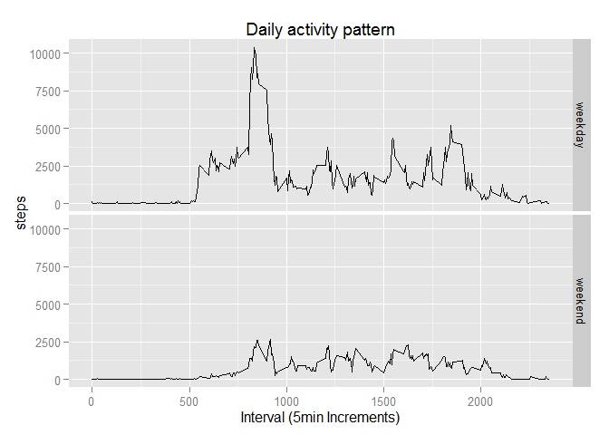

# Reproducible Research Project 1 - Active Monitoring Data
Ruben Llibre  
Sunday, June 07, 2015  

*Last updated on: Thu Jun 11 22:18:00 2015*

***


### Loading and preprocessing the data

#### Load libraries to be used

```r
require(dplyr)
require(ggplot2)
```

**1. Load the data (i.e. read.csv())**


```r
df <- read.csv("activity.csv", colClasses = c("integer","Date","integer"))
summary(df)
```

```
##      steps             date               interval     
##  Min.   :  0.00   Min.   :2012-10-01   Min.   :   0.0  
##  1st Qu.:  0.00   1st Qu.:2012-10-16   1st Qu.: 588.8  
##  Median :  0.00   Median :2012-10-31   Median :1177.5  
##  Mean   : 37.38   Mean   :2012-10-31   Mean   :1177.5  
##  3rd Qu.: 12.00   3rd Qu.:2012-11-15   3rd Qu.:1766.2  
##  Max.   :806.00   Max.   :2012-11-30   Max.   :2355.0  
##  NA's   :2304
```

**2. Process/transform the data (if necessary) into a format suitable for your analysis**

Make dates from factor into proper date format

```r
df$date <- as.Date(df$date)
str(df)
```

```
## 'data.frame':	17568 obs. of  3 variables:
##  $ steps   : int  NA NA NA NA NA NA NA NA NA NA ...
##  $ date    : Date, format: "2012-10-01" "2012-10-01" ...
##  $ interval: int  0 5 10 15 20 25 30 35 40 45 ...
```

***
### What is mean total number of steps taken per day?

For this part of the assignment, i'm **ignoring the missing values** in the dataset.

**1. Calculate the total number of steps taken per day**

group data by date, then look for total mean number of steps taken per day

```r
df_bydate <- group_by(df,date)
steps_by_date <- summarise(df_bydate, total_steps = sum(steps,na.rm=T))
head(steps_by_date)
```

```
## Source: local data frame [6 x 2]
## 
##         date total_steps
## 1 2012-10-01           0
## 2 2012-10-02         126
## 3 2012-10-03       11352
## 4 2012-10-04       12116
## 5 2012-10-05       13294
## 6 2012-10-06       15420
```

```r
total_mean=mean(steps_by_date$total_steps)
total_mean
```

```
## [1] 9354.23
```

**2. Make a histogram of the total number of steps taken each day**


```r
qplot(total_steps, data=steps_by_date, geom="histogram",binwidth=2000,
      fill=I("orange"),col=I("red"),alpha=I(.3),
      main="Total steps per day",xlab="Total steps per day")
```

 

**3. Calculate and report the mean and median of the total number of steps taken per day**

Calculating a Dataframe with a per-day mean/median (in case you want it)


```r
steps_by_date_2 <- summarise(df_bydate, total_steps = sum(steps,na.rm=T), median=median(steps,na.rm=T),mean=mean(steps,na.rm=T))
head(steps_by_date_2)
```

```
## Source: local data frame [6 x 4]
## 
##         date total_steps median     mean
## 1 2012-10-01           0     NA       NA
## 2 2012-10-02         126      0  0.43750
## 3 2012-10-03       11352      0 39.41667
## 4 2012-10-04       12116      0 42.06944
## 5 2012-10-05       13294      0 46.15972
## 6 2012-10-06       15420      0 53.54167
```

Calculating totalized mean/median for all days


```r
#save for future use
Omean <- mean(steps_by_date$total_steps)
Omedian <- median(steps_by_date$total_steps)
#print
Omean
```

```
## [1] 9354.23
```

```r
Omedian
```

```
## [1] 10395
```
***

### What is the average daily activity pattern?

**1. Make a time series plot (i.e. type = "l") of the 5-minute interval (x-axis) and the average number of steps taken, averaged across all days (y-axis)**


```r
df_byinterval <- group_by(df,interval)
df_byinterval_summary <- summarise(df_byinterval, 
  steps = mean(steps,na.rm=T))
qplot(interval,steps, data=df_byinterval_summary, geom="line",
      xlab="Interval (5min Increments)")
```

 

**2. Which 5-minute interval, on average across all the days in the dataset, contains the maximum number of steps?**


```r
#find interval with steps = max steps
interval_max_steps <- which(
  df_byinterval_summary$steps==max(df_byinterval_summary$steps))
max_interval <- df_byinterval_summary$interval[interval_max_steps]
max_steps <- max(df_byinterval_summary$steps)
print(paste0( "max interval is: ",max_interval, " averaging ",max_steps, 
              " across all days in dataset."  ))
```

```
## [1] "max interval is: 835 averaging 206.169811320755 across all days in dataset."
```

***

### Imputing missing values

**1. Calculate and report the total number of missing values in the dataset (i.e. the total number of rows with NAs)**


```r
#calculate NAs found per column
apply(df,2,function(x) { length( which( is.na(x) ) ) } )
```

```
##    steps     date interval 
##     2304        0        0
```

```r
#double check out steps values, since it's the one we care for
length(which(is.na(df$steps)))
```

```
## [1] 2304
```

**2. Devise a strategy for filling in all of the missing values in the dataset. The strategy does not need to be sophisticated. For example, you could use the mean/median for that day, or the mean for that 5-minute interval, etc.**

Using the interval-mean across all days as a fill-in strategy.

**3. Create a new dataset that is equal to the original dataset but with the missing data filled in.**


```r
#copy original data
df_filledin <- df
for (i in 1:nrow(df_filledin)) { 
  #if rows teps contains NA, fix!
  if( is.na(df_filledin[i,]$steps)  ) { 
    iInterval <-df_filledin[i, ]$interval #interval we want mean for
    df_filledin[i, ]$steps <- 
      subset(df_byinterval_summary,interval==iInterval)$steps
  }
} 
head(df_filledin)
```

```
##       steps       date interval
## 1 1.7169811 2012-10-01        0
## 2 0.3396226 2012-10-01        5
## 3 0.1320755 2012-10-01       10
## 4 0.1509434 2012-10-01       15
## 5 0.0754717 2012-10-01       20
## 6 2.0943396 2012-10-01       25
```

**4. Make a histogram of the total number of steps taken each day and Calculate and report the mean and median total number of steps taken per day. Do these values differ from the estimates from the first part of the assignment? What is the impact of imputing missing data on the estimates of the total daily number of steps?**

***


```r
df_filledin_bydate <- group_by(df_filledin,date)
steps_filledin_by_date <- summarise(df_filledin_bydate, total_steps = sum(steps,na.rm=T))
qplot(total_steps, data=steps_filledin_by_date, geom="histogram",binwidth=2000,
      fill=I("orange"),col=I("red"),alpha=I(.3),
      main="Total steps per day with Fill in Data",xlab="Total steps (filled in) per day")
```

 

```r
#Filled in mean
Fmean <- mean(steps_filledin_by_date$total_steps)
#Filled in median
Fmedian <- median(steps_filledin_by_date$total_steps)

cat(paste0(
  "Original mean: ",Omean,"\n",
  "Filled-in mean: ",Fmean,"\n\t",
  "Difference in mean: ",Omean-Fmean,"\n",
  "Original median: ",Omedian,"\n",
  "Filled-in median: ",Fmedian,"\n\t",
  "Difference in median: ",Omedian-Fmedian))
```

```
## Original mean: 9354.22950819672
## Filled-in mean: 10766.1886792453
## 	Difference in mean: -1411.95917104856
## Original median: 10395
## Filled-in median: 10766.1886792453
## 	Difference in median: -371.188679245282
```

### Are there differences in activity patterns between weekdays and weekends?

Using the dataset with the filled-in missing values for this part.

**1. Create a new factor variable in the dataset with two levels - "weekday" and "weekend" indicating whether a given date is a weekday or weekend day.**


```r
dayf <- factor(weekdays(df_filledin$date) %in% c("Saturday","Sunday"), 
          labels=c("weekday","weekend"), ordered=FALSE)
df_filledin$day <- dayf
head(df_filledin)
```

```
##       steps       date interval     day
## 1 1.7169811 2012-10-01        0 weekday
## 2 0.3396226 2012-10-01        5 weekday
## 3 0.1320755 2012-10-01       10 weekday
## 4 0.1509434 2012-10-01       15 weekday
## 5 0.0754717 2012-10-01       20 weekday
## 6 2.0943396 2012-10-01       25 weekday
```

**2. Make a panel plot containing a time series plot (i.e. type = "l") of the 5-minute interval (x-axis) and the average number of steps taken, averaged across all weekday days or weekend days (y-axis).**


```r
df_filledin_byintervalday <- group_by(df_filledin,interval,day)
steps_filledin_by_intervalday <- summarise(df_filledin_byintervalday, 
  steps = sum(steps,na.rm=T))
qplot(interval,steps, data=steps_filledin_by_intervalday, geom="line",
      xlab="Interval (5min Increments)",main="Daily activity pattern",
      facets=day~.)
```

 
