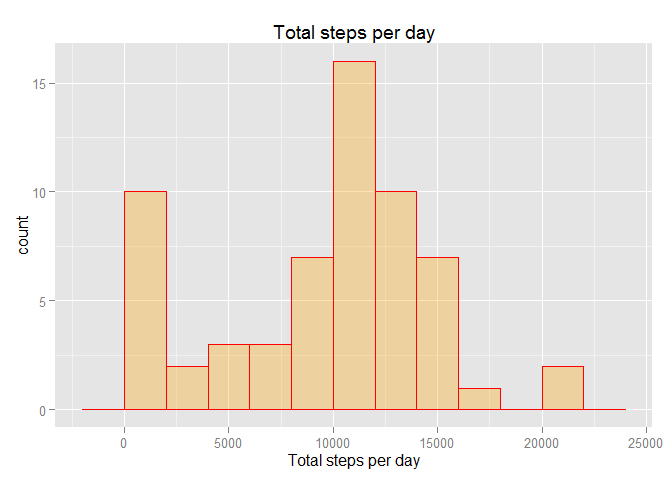
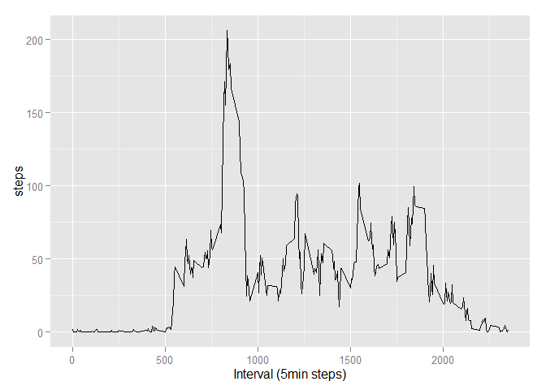

# Reproducible Research Project 1 - Active Monitoring Data
Ruben Llibre  
Sunday, June 07, 2015  

*Last updated on: Wed Jun 10 00:45:05 2015*

***


### Loading and preprocessing the data

#### Load libraries to be used

```r
require(dplyr)
require(ggplot2)
require(xtable)
```

**1. Load the data (i.e. read.csv())**


```r
df <- read.csv("activity.csv")
head(df)
```

```
##   steps       date interval
## 1    NA 2012-10-01        0
## 2    NA 2012-10-01        5
## 3    NA 2012-10-01       10
## 4    NA 2012-10-01       15
## 5    NA 2012-10-01       20
## 6    NA 2012-10-01       25
```

```r
str(df)
```

```
## 'data.frame':	17568 obs. of  3 variables:
##  $ steps   : int  NA NA NA NA NA NA NA NA NA NA ...
##  $ date    : Factor w/ 61 levels "2012-10-01","2012-10-02",..: 1 1 1 1 1 1 1 1 1 1 ...
##  $ interval: int  0 5 10 15 20 25 30 35 40 45 ...
```

**2. Process/transform the data (if necessary) into a format suitable for your analysis**

+ Make dates from factor into proper date format

```r
df$date <- as.Date(df$date)
str(df)
```

```
## 'data.frame':	17568 obs. of  3 variables:
##  $ steps   : int  NA NA NA NA NA NA NA NA NA NA ...
##  $ date    : Date, format: "2012-10-01" "2012-10-01" ...
##  $ interval: int  0 5 10 15 20 25 30 35 40 45 ...
```

***
### What is mean total number of steps taken per day?

For this part of the assignment, i'm **ignoring the missing values** in the dataset.

**1. Calculate the total number of steps taken per day**

+ group data by date

```r
df_bydate <- group_by(df,date)
steps_by_date <- summarise(df_bydate, total_steps = sum(steps,na.rm=T))
head(steps_by_date)
```

```
## Source: local data frame [6 x 2]
## 
##         date total_steps
## 1 2012-10-01           0
## 2 2012-10-02         126
## 3 2012-10-03       11352
## 4 2012-10-04       12116
## 5 2012-10-05       13294
## 6 2012-10-06       15420
```

**2. Make a histogram of the total number of steps taken each day**


```r
qplot(total_steps, data=steps_by_date, geom="histogram",binwidth=2000,
      fill=I("orange"),col=I("red"),alpha=I(.3),
      main="Total steps per day",xlab="Total steps per day")
```

 

**3. Calculate and report the mean and median of the total number of steps taken per day**

+ Calculating a Dataframe with a per-day mean/median (in case you want it)


```r
steps_by_date_2 <- summarise(df_bydate, total_steps = sum(steps,na.rm=T), median=median(steps,na.rm=T),mean=mean(steps,na.rm=T))
head(steps_by_date_2)
```

```
## Source: local data frame [6 x 4]
## 
##         date total_steps median     mean
## 1 2012-10-01           0     NA       NA
## 2 2012-10-02         126      0  0.43750
## 3 2012-10-03       11352      0 39.41667
## 4 2012-10-04       12116      0 42.06944
## 5 2012-10-05       13294      0 46.15972
## 6 2012-10-06       15420      0 53.54167
```
+ Calculating totalized mean/median for all days


```r
mean(steps_by_date$total_steps)
```

```
## [1] 9354.23
```

```r
median(steps_by_date$total_steps)
```

```
## [1] 10395
```
***

### What is the average daily activity pattern?

**1. Make a time series plot (i.e. type = "l") of the 5-minute interval (x-axis) and the average number of steps taken, averaged across all days (y-axis)**


```r
df_byinterval <- group_by(df,interval)
df_byinterval_summary <- summarise(df_byinterval, 
  steps = mean(steps,na.rm=T))
qplot(interval,steps, data=df_byinterval_summary, geom="line",
      xlab="Interval (5min steps)")
```

 

**2. Which 5-minute interval, on average across all the days in the dataset, contains the maximum number of steps?**


```r
df_byinterval_summary[df_byinterval_summary$steps==max(df_byinterval_summary$steps), ]
```

```
## Source: local data frame [1 x 2]
## 
##   interval    steps
## 1      835 206.1698
```

***

### Imputing missing values

Note that there are a number of days/intervals where there are missing values (coded as NA). The presence of missing days may introduce bias into some calculations or summaries of the data.

**1. Calculate and report the total number of missing values in the dataset (i.e. the total number of rows with NAs)**


```r
#calculate NAs found per column
apply(df,2,function(x) { length( which( is.na(x) ) ) } )
```

```
##    steps     date interval 
##     2304        0        0
```

```r
#double check out steps values, since it's the one we care for
length(which(is.na(df$steps)))
```

```
## [1] 2304
```

**2. Devise a strategy for filling in all of the missing values in the dataset. The strategy does not need to be sophisticated. For example, you could use the mean/median for that day, or the mean for that 5-minute interval, etc.**

+ using the mean for the day as a fill-in strategy

**3. Create a new dataset that is equal to the original dataset but with the missing data filled in.**

#read this
[sO](https://stackoverflow.com/questions/7279089/replace-all-na-with-false-in-selected-columns-in-r)

```r
#copy original data
df_filledin <- df
```

**4. Make a histogram of the total number of steps taken each day and Calculate and report the mean and median total number of steps taken per day. Do these values differ from the estimates from the first part of the assignment? What is the impact of imputing missing data on the estimates of the total daily number of steps?**

***

### Are there differences in activity patterns between weekdays and weekends?

For this part the weekdays() function may be of some help here. Use the dataset with the filled-in missing values for this part.

**1. Create a new factor variable in the dataset with two levels - "weekday" and "weekend" indicating whether a given date is a weekday or weekend day.**

**2. Make a panel plot containing a time series plot (i.e. type = "l") of the 5-minute interval (x-axis) and the average number of steps taken, averaged across all weekday days or weekend days (y-axis). See the README file in the GitHub repository to see an example of what this plot should look like using simulated data.**
